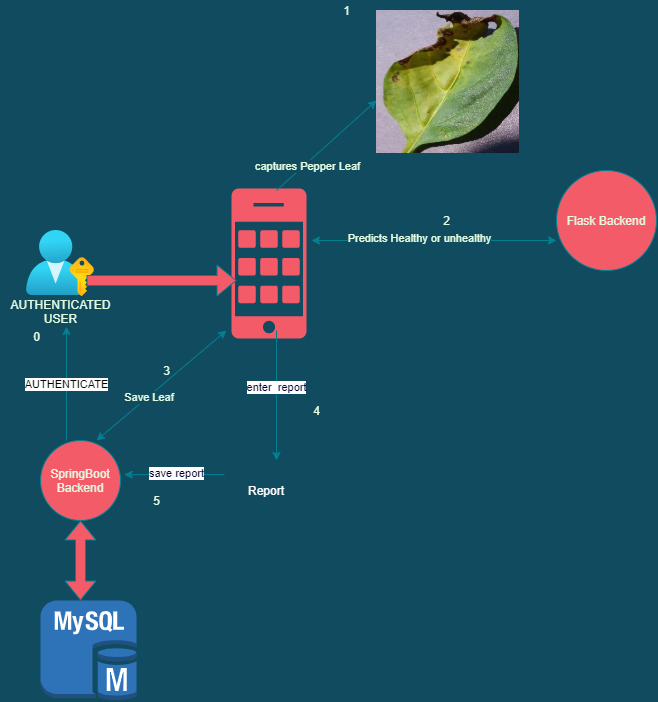

# Leaver Android Application

This is an Android App made for farm inspection authorities.
In this app an user can capture the pepper leaf and leaverApp 
will predict as healthy and unhealthy . User can also choose from
gallery or photos  leaverApp will do the same. After doing this for 
many leaves ,user can click on make report. The report contains all the details 
done in the inspection.

# Technical Description
1. Frontend: Anddoid -> Kotlin
2. Backend:  Spring Boot->Java
3. model prediction: flask->python

## Architecture

  

## Screenshots

  
## Contributing

Contributions are always welcome!

I am looking for the people who can work with me on this project
. And help me take this  app  'TO THE MOON' :)

contact me @rajhmourya@gmail.com

  